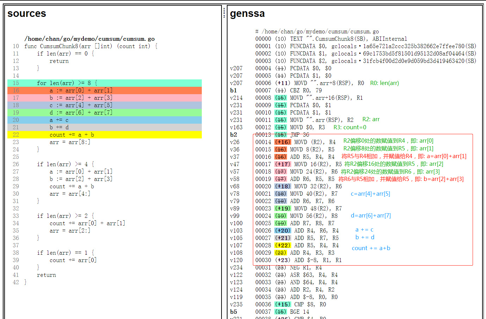

# 纯 Go 代码完成 ARM64 流水线和指令级优化

### 一道“送命”的面试题
“哥!”面试回来的老弟一脸委屈：“你不是在搞优化么？帮我分析这道题，就因为它，害的我的面试凉凉了。” 
```go
// 请优化以下切片累加求和代码，使运算性能平均提升 10%+。
func Cumsum(arr []int) (count int) {
	for i := 0; i < len(arr); i++ {
		count += arr[i]     // 遍历切片元素，累加求和
	}
	return
}
```
我看了下题目说到：“这道题通过‘减少指令数据依赖’、‘最大化利用寄存器’等手段，减少CPU气泡，即可进行“CPU流水线”层面的优化。”  
“说这一堆的名词，听着都晕。能不能Show me your code!”老弟有些期待。  
“那就废话不多说，Go、Go、Go...”

### 流水线和指令级优化并不遥远

#### 1. 问题分析  
上题通过遍历切片元素，将值累加到count得到最终结果，每次遍历求和的运算都对上一次的结果（count）产生依赖，整个运算过程成链条状态，环环相扣，指令无法并行，整体耗时则为所有运算时间和。  
CPU流水线是一种将指令分解为多步的技术，不同步骤可以并行处理。我们只需将运算的依赖分散，同时使用多个变量存储中间变量提升寄存器的使用数量，这样就可以获得CPU流水线层面的提升。

#### 2. 优化代码
   ```go
   func CumsumChunk8(arr []int) (count int) {
	if len(arr) == 0 {
		return
	}

    // len >= 8 时，每 8 个元素一次循环，分成 4 组相加，减少依赖；
    // 使用 4 个变量暂存计算结果，促使更多的寄存器被使用
	for len(arr) >= 8 {
		a := arr[0] + arr[1]
		b := arr[2] + arr[3]
		c := arr[4] + arr[5]
		d := arr[6] + arr[7]
		a += c
		b += d
		count += a + b
		arr = arr[8:]
	}

    // 4 <= len < 8 ，取 4 个元素，分成 2 组相加
	if len(arr) >= 4 {
		a := arr[0] + arr[1]
		b := arr[2] + arr[3]
		count += a + b
		arr = arr[4:]
	}

    // 2 <= len < 4, 取 2 个元素
	if len(arr) >= 2 {
		count += arr[0] + arr[1]
		arr = arr[2:]
	}

    // len == 1, 直接相加
	if len(arr) == 1 {
		count += arr[0]
	}
	return
   }
   ```
   
#### 3. 优化结果：
使用[benchstat工具](https://godoc.org/golang.org/x/perf/cmd/benchstat)进行性能对比：
   ```bash
   name            old time/op    new time/op    delta
   Cumsum/0-8        5.01ns ± 0%    3.86ns ± 0%  -22.95%  (p=0.002 n=8+10)
   Cumsum/1-8        5.40ns ± 0%    5.40ns ± 0%     ~     (all equal)
   Cumsum/7-8        10.6ns ± 0%     7.1ns ± 0%  -33.44%  (p=0.000 n=7+10)
   Cumsum/8-8        11.4ns ± 0%     7.7ns ± 0%  -32.25%  (p=0.000 n=9+10)
   Cumsum/15-8       16.7ns ± 0%    10.4ns ± 0%  -37.43%  (p=0.000 n=10+10)
   Cumsum/16-8       17.4ns ± 0%    10.7ns ± 1%  -38.33%  (p=0.000 n=10+10)
   Cumsum/127-8      88.8ns ± 0%    45.4ns ± 0%  -48.86%  (p=0.000 n=9+8)
   Cumsum/4095-8     3.17µs ± 0%    1.28µs ± 0%  -59.66%  (p=0.000 n=10+9)
   Cumsum/99999-8    86.3µs ± 3%    53.4µs ±15%  -38.11%  (p=0.000 n=10+10)
   ```
   优化后的代码性能提升高了 **30% +**，很显然，这和我们的预期是一致的，但前面所提到CPU流水线的手段：“减少依赖”、“使用更多的寄存器”在哪里有更为直观的体现呢？
   
#### 4. ARM64汇编层面查看优化：  
我们知道Go代码最终会被编译成汇编代码在对应的平台执行，要想更直观的了解优化前后的变化，我只需要利用go的compile工具，编译出对应的汇编代码进行比较，就可以直达“真相”。  
##### 4.1 优化前：  
   
上图为优化前的代码与汇编代码对照，为了方便理解，已对汇编代码中关键部分进行了标识。在这里我们只需要关注红框标记部分，正如我们之前的判断：
- 运算中仅使用“R3”和“R5”寄存器（R3和R5为Go Plan9汇编寄存器名称）  
- 每次运算都对R3寄存器中的数据强依赖

##### 4.2 优化后：  
   
如图，红框中代码对应左边的for循环（省略了部分汇编代码），相对于修改之前的汇编代码，发生了如下的变化：
- 参与到运算的寄存器由之前的2个增加到了5个（R4~R8）
- 每次运算寄存器之间的依赖大大减少

### 极限性能的思考
“哥，这也太牛了吧！轻轻松松就提升了30%多。”老弟有些兴奋，“这应该极限性能了吧？”  
“No，哪里那么容易到极限性能呀。很明显的，加大分块的力度可以更好的解耦依赖关系；另外我们运算的都是同一条加法指令，只是数据不同而已，这符合 SIMD 指令的情景，你如果感兴趣的话，可以尝试优化下。”乘着机会，我给老弟留了一道极限性能的课后题。  

### 附录
[获取源码](source/)  
[SIMD优化案例](../simd/Go-On-ARM%20SIMD优化入门案例.md)
