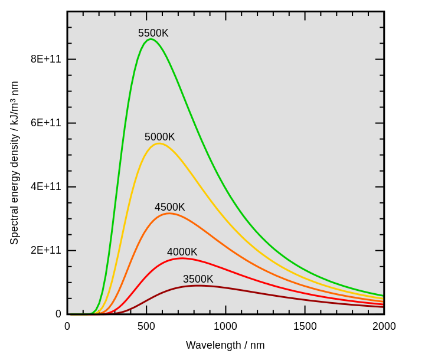
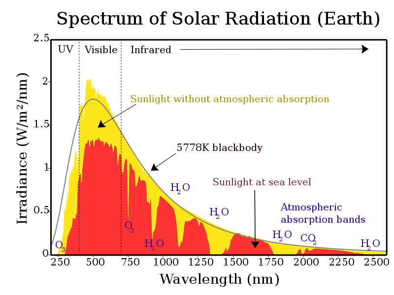

## 光

光是电磁波，可见光是可被人眼感知的电磁波。可见光大约在400-700nm波段[1]。光子携带的能量与波长成反比，400nm-700nm之间的单色光的颜色从紫色渐变成红色。

任何有温度的物体都能发出热辐射。在物理学上，会引入黑体[2]这个理想模型。黑体会吸收所有的光，也就是对所有波长的光的吸收率都为1，相应的，根据基尔霍夫热辐射定律[3]，黑体的发射率也都为1。在相同温度下，黑体发射的热辐射是所有物体中最大的。黑体能发射所有波长的光，各波长能量大小各有不同，这些不同波长不同密度的光形成光谱。黑体的光谱仅和温度相关，符合普朗克定律[4]。温度越高，辐射的总能量也越大，峰值波长越小。

太阳光是最常见的自然光源，在大气层外的太阳光谱近似约5800K的黑体辐射，峰值波长附近是可见光的范围。在进入地球后，部分波长的光被大气层吸收。受大气层的影响，太阳光在晨昏与正午的也显现出较大的不同。在色彩计算中，通常将晨昏的太阳光近似为5000K的黑体辐射，把正午的太阳光近似为6500K的黑体辐射。

地球其他物体的热辐射能量都很低，峰值波长基本都在红外波段，不能构成可见光源。

除了太阳光源外，LED灯、白炽灯等各种照明设备也是摄影的主要光源。除此之外，火、荧光、磷光、生物发光等也是可见光源。

通常情况大部分光源发射的都是连续波长的光构成的，或称为**光谱**[6]，但人工能造出光谱范围窄、单色性好的光源，如激光[7]。

### 光度与辐射量

在物理上，有两套刻画电磁辐射强度的单位[13]。一套是辐射量相关的，它以电磁辐射能量来刻画辐射强度；第二套是与光度（luminous intensity）[10]相关的，它刻画了人对光源的亮度（brightness）感受。显然，只有可见光部分的电磁辐射才能对亮度有影响。如果对于每个波长的可见光，都有对应的亮度感受，那么辐射量都能转换成光度量，而这个对应关系也称为光度函数[11]。当然，由于每个人对光的亮度感受是有差异的，所以这个光度函数是人为规定的。而就是这个主观性很强的光度，却在席位不多的SI单位制上获得了一个基础单位（坎德拉，cd）[12]。

亮度（brightness）[14]这个词语在光度学承载了许多极易混乱的概念（luminance[9]，Illuminance[15]，luminosity[16]等），原因通常是描绘不同物体的亮度的时候会使用不同的物理量。在介绍色彩空间的时候，luminance和brightness都被翻译成亮度，其中luminance为光度学测量量，表示给定方向单位面积的光度，它与光的辐射量成正比；而brightness是主观感受的亮度，通常用前者通过伽马校正[17]等变换后的量来描述后者。在本文中，仅在需要区分的场合下，会用光度学亮度和主观亮度分别指代。

## 标准光源

为了模拟计算各种光源，[国际照明委员会](https://en.wikipedia.org/wiki/International_Commission_on_Illumination)(CIE) 发布了标准光源及其光谱。常使用的是光源A、D、E等系列。

### 标准观察者

由于视锥在眼睛中的分布，三刺激值取决于观察者的视野。为了消除此变量，CIE定义了一种称为标准观察者，实质是个色度函数（类比与前文的光度函数），以表示中央凹内2°弧内人类的平均色响应。选择该角度是因为相信颜色敏感的圆锥体位于中央凹的2°弧内。因此，CIE 1931标准观察者也称为CIE 1931 2°标准观察者。一种更现代但使用较少的替代方法是CIE 1964 10°标准观察者。

### 白点

当使用光源测量颜色时，光源照射在物体表面上。通过测量不同波长的反射系数，与光源的光谱功率分布（SPD），以及色度函数，我们可以测量物体在光源下的颜色。如果物体反射所有波长，则该物体在该光源下所有分量都是最大的，称为该光源下的白点。由于白点反射了光源的所有光，不区分的情况下，也用白点指代光源。

### 白点、观察者、光源及色彩空间

白点对应着光谱分布，选定观察者后，使用相应的色度函数可以计算白点的色度值（即xyY值）；而根据物体的反射率，可以计算物体颜色在该白点下的色度值。因此在这光源下，可以测量色彩空间的三刺激值，可以从而构造出色彩空间来[20]。CIE XYZ空间是以标准观察者标准光源E（2 deg illuminant E，E_2）下构造的。而sRGB是在标准观察者标准光源D65下（2 deg illuminant D65，D65_2）进行的，而其三原色也是在D65_2下测量的色度值，对应的XYZ值虽然也被称为XYZ空间，但更准确的描述成XYZ-D65_2空间。

将色彩从一种光源变换成另一种光源下的操作叫色彩适应[18]。由于色彩是各波长反射函数到三刺激值的非单映射，这意味着在一种光源下相同的颜色可能在另一种光源下会有差异。因此正确的进行色彩适应是不可能的。但通常会用线性变换来近似色彩适应。

由于定义绝对色彩空间需要光源和观察者，由于后者通常是标准观察者，通常被忽略。本文中，有时候也会粗略的把后两者视为光源、白点，如称为D65_2光源或D65光源，白点定义为E_2等。

其中，涉及色彩空间的内容可以与色彩空间部分对照。

### 色温

如果光源符合黑体的光谱功率分布，则黑体的温度称为光源的色温[19]。如果不符合，则与其最相近的黑体辐射对应的温度称为相关色温（correlated color temperature，CCT）[19]。

### 标准光源

光源A使用2856K时黑体的相对光谱功率分布，用于模拟家用钨丝照明。白点在标准观察者下的色度坐标是（0.44758，0.40745），XYZ坐标值为（109.85，100.00，35.58），XYZ坐标可以由色度坐标计算得出。

D系列光源使用简单的函数来模拟日光，使用数字来代表色温。如D50代表5003K色温的D光源，通常用以模拟晨昏时的日光；而D65代表6504K色温，用以模拟正午时分的日光。

光源E是能量均布光源，也就是不同波长的光功率密度相同。它是个虚拟光源，用于定义CIE XYZ空间。它的色度坐标是（1/3,1/3），相关色温是5455K。

光源F系列和LED系列分别用以模拟荧光灯和LED灯。

常见光源的数据如下表所示：

|      | 2°色度             | 10°色度            | 色温 | 模拟         |
| ---- | ------------------ | ------------------ | ---- | ------------ |
| A    | (0.44757, 0.40745) | (0.45117, 0.40594) | 2856 | 白炽灯/钨丝  |
| D50  | (0.34567, 0.35850) | (0.34773, 0.35952) | 5003 | 晨昏日光     |
| D65  | (0.31271, 0.32902) | (0.31382, 0.33100) | 6504 | 正午日光     |
| E    | (1/3, 1/3)         | (1/3, 1/3)         | 5454 | 能量均布光源 |

## 参考文献

1. https://en.wikipedia.org/wiki/Light
2. https://en.wikipedia.org/wiki/Black_body
3. [https://en.wikipedia.org/wiki/Kirchhoff%27s_law_of_thermal_radiation](https://en.wikipedia.org/wiki/Kirchhoff's_law_of_thermal_radiation)
4. [https://en.wikipedia.org/wiki/Planck%27s_law](https://en.wikipedia.org/wiki/Planck's_law)
5. https://en.wikipedia.org/wiki/Sunlight
6. https://en.wikipedia.org/wiki/Spectrum
7. https://en.wikipedia.org/wiki/Laser
8. https://en.wikipedia.org/wiki/Standard_illuminant
9. https://en.wikipedia.org/wiki/Luminance
10. https://en.wikipedia.org/wiki/Luminous_intensity
11. https://en.wikipedia.org/wiki/Luminosity_function
12. https://en.wikipedia.org/wiki/International_System_of_Units
13. https://en.wikipedia.org/wiki/Photometry_(optics)
14. https://en.wikipedia.org/wiki/Brightness
15. https://en.wikipedia.org/wiki/Illuminance
16. https://en.wikipedia.org/wiki/Luminosity
17. https://en.wikipedia.org/wiki/Gamma_correction
18. https://en.wikipedia.org/wiki/Chromatic_adaptation
19. https://en.wikipedia.org/wiki/Color_temperature
20. [A review of RGB color spaces](http://www.babelcolor.com/index_htm_files/A review of RGB color spaces.pdf)

