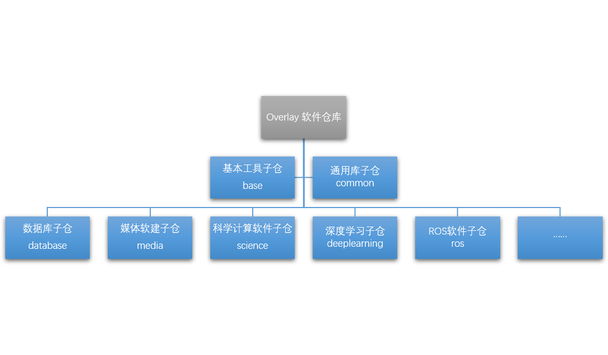
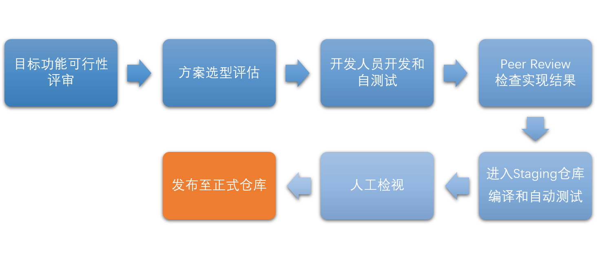
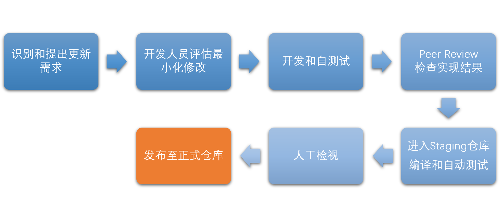
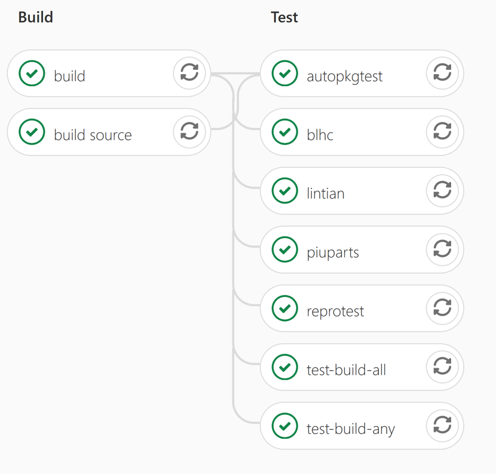

# OptimizeLab Overlay 开发者指南
> OptimizeLab Overlay 软件仓库当前主要针对 aarch64 架构提供关键应用和函数库的高性能预编译版本，采用 Launchpad PPA 的方式提供，以 Ubuntu 18.04 LTS 和 Ubuntu 20.04 LTS 为基础版本。这份指南旨在说明参与这个仓库开发所需要的技术和方法，以便能够迅速上手开展工作。

## 仓库架构

仓库目前分为四个组件：`base`, `database`, `media` 和 `science`。随着开发工作的不断进行，我们还将根据用户反馈和开发计划增设更多分类。

用户可以按照需要安装以下任意数量的仓库，但是它们大多数都依赖于 `base` 组件的启用，其中承载了对基本系统开发工具如编译工具链的修改。`database` 组件主要是 MySQL、PostgreSQL 等数据库管理系统，`media` 是音视频编解码相关软件，`science` 以科学计算核心软件包为目标，主要面向科学计算和 HPC 等使用场景。

目前已规划增加的子仓还有 `common` 通用库子仓，`deeplearning` 深度学习软件子仓，`ros` 机器人软件子仓等。



## 总体原则

仓库中的应用不是越多越好，软件包数量的增加也同事意味着维护量的增加，在达到一定数量后会导致整体的质量下降，OptimizeLab Overlay 仓库面向性能优化，定位于提供高质量维护的软件版本，因此仓库中的软件包需要经过仔细甄别和选型，以达到以下目的：

1. 能够为用户带来性能提升、重要功能添加；
2. 使用过程中不与系统现有的的软件产生冲突；
3. 避免对使用仓库中软件的普通开发者造成干扰；例如，使动态编译的应用程序仍能在多数情况下保持和原装系统一致的 ABI 兼容性，以便在使用了本仓库的开发环境编译出的应用程序能够平顺地在没有使用本仓库的同版本环境下运行使用
4. 要保证用户能够安全平顺地升级到更高版本的 Ubuntu LTS，即保留一条通畅的 `upgrade path`。
5. 仅在必要位置引入修改，控制潜在维护工作规模。

## 开发测试环境约定

在开发过程中，需要遵循以下几点原则：
1. 进行开发测试使用的环境，应与目标环境的大版本一致
2. 编译测试环境为最小基本系统环境，仅安装 `build-essential` 和软件包依赖关系中显式声明了的软件包
3. 不同软件编译测试时，每次都使用全新的环境，以免前序的编译测试活动改变了编译环境，影响后续编译结果
4. 在编译过程中，依赖关系解析遵循唯一选择原则，即在依赖声明中有多个候选软件时，仅用将第一个用于满足依赖关系，若不能满足则编译不能继续进行
5. 推荐使用 _sbuild_ 或 _pbuilder_ 辅助构建开发测试环境

* [sbuild 使用文档](https://wiki.debian.org/sbuild)
* [pbuilder 使用文档](https://pbuilder-team.pages.debian.net/pbuilder/)

## 兼容性技术约定

1. 对库函数软件进行修改时，要求保证 API 与原版本兼容，一般情况下 ABI 也要求兼容
2. 对于不能保持 ABI 兼容性的函数库，要求检视其所有反向依赖软件，仅当反向依赖软件数量小于10且均为无深层依赖关系的 leaf package 时才可纳入评估
3. 工具链类软件，不能对系统的默认大版本和编译参数进行静默修改
4. 不同场景、类别的软件存放在单独的子仓内，各子仓之间除 `base` 和 `common` 外不得有依存关系
5. 对于最终应用软件，应检视其所有反向以来软件，评估并验证存在进程调用关系情况下的行为兼容性

## 开发和维护

### 首次发布流程
整体开发和发布流程分为7个步骤，为使流程尽可能轻量化，仅需对每个结点在必要时给出说明。



目前已自动化功能：
* 自动编译和发布到 Staging 仓库，人工复检后一键发布至正式仓库

已规划自动化功能：
* 通过 git 仓库直接推送至编译环节
* 使用 debci 平台对 Staging 仓库进行自动测试用例运行

暂无计划自动化部分：
* 在引入新的软件包、更新软件包大版本时，需按照 Debian 要求对软件进行许可证人工检视
* 在方案选型评估中，必要情况下需对上游社区代码进行工具扫描和人工检视，以便预估后续维护难度

### 维护策略及更新流程

升级维护策略与所针对的软件有强相关性，软件仓库内的软件包，需要持续跟踪安全问题的更新，并在条件允许的情况下为软件包提供质量更新。Ubuntu 官方版本已修复的安全和质量问题，100% 需要经过辨别确保在本仓库中也进行了修复。

* 进行升级维护时，采用最小化修改原则，在条件允许的情况下仅做修复目标问题的必要改动
* 对于 Ubuntu 官方版本已修复的安全和质量问题，100% 经过辨别确保仓库版本也进行了修复
* 对于原发行版不涉及的问题，跟踪上游安全和质量问题列表，及时做出维护响应
* 不进行影响系统安全模型的修改，遵循原发行版的仓库完整性、自动升级功能、启动安全性、默认网络安全、应用程序隔离等安全设计
* 对密码学相关软件和可能影响 FIPS 相容性的变更，采取审慎态度，默认不予引入



### 发布过程中的 QA 流水线

整个发布流水线分 *Build* 和 *Test* 两大环节，具体内容如下：

* Build:
  * build: 二进制包打包生成
  * build-source: 源代码包打包生成

* Test:
  * autopkgtest: 运行 debci 自动测试用例
  * blhc: 编译日志分析扫描
  * lintian: 积累性常见问题扫描
  * piuparts: 安装和升级操作测试
  * reprotest: 二进制 reproducible 编译验证测试
  * test-build-all: 针对架构无关软件包单独编译测试
  * test-build-all: 针对架构相关软件包单独编译测试



除以上步骤外，在进入正式仓库前还要进行人工检视，以确保各步骤验证无退行问题、未引入新问题。

### debci 自动测试要求


## 基础技能

### Debian 软件打包入门

Ubuntu 系统基于 Debian 开发，使用 `.deb` 软件包格式，因此掌握 Debian 软件打包是参与 OptimizeLab Overlay 的最基本技能。要掌握 Debian 软件打包的基本知识，请阅读以下文档：

* [Debian 新维护人员手册（汉语）](https://www.debian.org/doc/manuals/maint-guide/index.zh-cn.html)
* [Debian 打包教程（英语，PDF）](https://www.debian.org/doc/manuals/packaging-tutorial/packaging-tutorial.en.pdf)

入门教程之外，还推荐阅读以下这些文档。其中讲述了 Debian 的技术标准、对自由软件的价值观，以及在过往经历中许多开发者总结下的最佳实践，是官方开发人员必读文档。

* [Debian Policy Manual](https://www.debian.org/doc/debian-policy/)
* [Debian 自由软件指导方针](https://www.debian.org/social_contract#guidelines)
* [Debian 开发人员参考指南](https://www.debian.org/doc/manuals/developers-reference/index.en.html)

### 如何确认反向依赖关系

使用 `apt rdepends <package>` 命令可以列出一个软件包的反向依赖关系。例如要查询依赖软件包 julia 的所有软件包：

```
 $ apt rdepends julia
 julia
 Reverse Depends:
   Breaks: julia-common (<< 0.4.1-1~)
   Replaces: libjulia1 (<< 0.5.0~)
   Breaks: libjulia1 (<< 0.5.0~)
   Suggests: julia-doc
   Replaces: julia-common (<< 0.4.1-1~)
   Recommends: julia-common
   Recommends: science-mathematics
   Suggests: elpa-ess
   Recommends: science-numericalcomputation
```

### 什么是 API，什么是 ABI？

API 是 Application Programming Interface 的缩写，ABI 是 Application Binary Interface 的缩写。API 兼容性所解决的问题是 API 不变的情况下，一段代码可以调用任意版本的函数库进行编译得到可用的程序；ABI 兼容性则表示，一段代码使用任意兼容版本编译获得的二进制文件，可以动态调用 ABI 兼容的其他版本二进制函数库文件（so、dll等）而无需重新编译。

其中应用程序的 ABI 具体通常包括如下几个方面：
* 调用约定
* 数据类型
* 传参方法
* 返回值获得方法
* 程序库函数
* 二进制目标文件格式
* 异常处理规程
* 字节码序列化方式
* 寄存器使用
* ......

在 Linux 平台上，除字节码类应用外，通常情况下大多数常规条件时默认兼容的（目标文件格式、函数调用规程等），主要需要考虑程序的符号表中的函数数据类型、传参、返回值等内容。

### 如何查看一个动态链接的二进制文件的符号表？

可以使用 `objdump` 工具，它存在于 `binutils` 软件包里。在这个例子中，我们分析了 _libzstd.so.1.3.8_ 的符号表，为了能够更清楚地看到函数库自带的符号，我们排除了带有 GLIBC 标记的部分，并取前 30 行以保持简洁。

```
 $ objdump -T libzstd.so.1.3.8 | grep -v GLIBC | head -30

 libzstd.so.1.3.8:     file format elf64-x86-64

 DYNAMIC SYMBOL TABLE:
 0000000000000000  w   D  *UND*  0000000000000000              _ITM_deregisterTMCloneTable
 0000000000000000  w   D  *UND*  0000000000000000              __gmon_start__
 0000000000000000  w   D  *UND*  0000000000000000              _ITM_registerTMCloneTable
 000000000006c990 g    DF .text  0000000000000005  Base        ZBUFF_decompressInit
 000000000006c740 g    DF .text  000000000000000a  Base        ZBUFF_isError
 000000000000d890 g    DF .text  00000000000001f8  Base        ZSTD_CCtxParam_getParameter
 00000000000670d0 g    DF .text  000000000000006e  Base        ZSTD_DCtx_setMaxWindowSize
 000000000000db30 g    DF .text  0000000000000031  Base        ZSTD_CCtx_refCDict
 0000000000067090 g    DF .text  000000000000003d  Base        ZSTD_dParam_getBounds
 0000000000013850 g    DF .text  000000000000007f  Base        ZSTD_compressStream2_simpleArgs
 0000000000065860 g    DF .text  0000000000000007  Base        ZSTD_getFrameHeader
 0000000000065550 g    DF .text  000000000000026e  Base        ZSTD_getFrameHeader_advanced
 0000000000012a90 g    DF .text  000000000000013b  Base        ZSTD_CCtx_loadDictionary_advanced
 0000000000077be0 g    DF .text  000000000000000a  Base        ZDICT_isError
 000000000005bcb0 g    DF .text  0000000000000025  Base        ZSTDMT_endStream
 00000000000113a0 g    DF .text  0000000000000006  Base        ZSTD_CStreamInSize
 0000000000010cf0 g    DF .text  000000000000007b  Base        ZSTD_freeCDict
 0000000000013600 g    DF .text  0000000000000219  Base        ZSTD_compressStream2
 0000000000013be0 g    DF .text  000000000000006e  Base        ZSTD_estimateCDictSize
 000000000000dbb0 g    DF .text  000000000000000a  Base        ZSTD_CCtx_refPrefix
 0000000000010fe0 g    DF .text  000000000000011c  Base        ZSTD_initStaticCDict
 00000000000672a0 g    DF .text  000000000000001d  Base        ZSTD_decodingBufferSize_min
 000000000000dbc0 g    DF .text  0000000000000064  Base        ZSTD_CCtx_reset
 00000000000118c0 g    DF .text  0000000000000006  Base        ZSTD_minCLevel
 0000000000067370 g    DF .text  0000000000000cec  Base        ZSTD_decompressStream
 000000000006c770 g    DF .text  0000000000000005  Base        ZBUFF_createCCtx
 ......
```

### 对于 C++ 程序，如何获得可读的符号表？

由于 C++ 程序的符号表中编译器 encode 了更多的信息，会对一般的人工分析造成干扰，此时可以使用 `c++filt` 命令进行 decode，例如我们对 _libboost system.so.1.67.0_ 进行解析，同样排除 GLIBC、C++ 标准库的影响，取前 30 行：

```
 $ objdump -T libboost_system.so.1.67.0 | grep -E -v "(GLIBC|CXX)" | head -30 | c++filt

 libboost_system.so.1.67.0:     file format elf64-x86-64

 DYNAMIC SYMBOL TABLE:
 0000000000000000  w   D  *UND*  0000000000000000              _ITM_deregisterTMCloneTable
 0000000000000000  w   D  *UND*  0000000000000000              __gmon_start__
 0000000000000000  w   D  *UND*  0000000000000000              _ITM_registerTMCloneTable
 0000000000002430 g    DF .text  00000000000000af  Base        boost::system::system_category()
 0000000000002cd0 g    DF .text  000000000000004d  Base        boost::system::detail::system_error_category::message[abi:cxx11](int) const
 0000000000002e70  w   DF .text  0000000000000052  Base        boost::system::detail::system_error_category::~system_error_category()
 0000000000005b28  w   DO .data.rel.ro   0000000000000018  Base        typeinfo for boost::system::error_category::std_category
 0000000000005b18  w   DO .data.rel.ro   0000000000000010  Base        typeinfo for boost::noncopyable_::noncopyable
 0000000000002dc0  w   DF .text  0000000000000019  Base        boost::system::error_category::std_category::default_error_condition(int) const
 0000000000002590 g    DF .text  0000000000000737  Base        boost::system::detail::system_error_category::default_error_condition(int) const
 0000000000005b70  w   DO .data.rel.ro   0000000000000018  Base        typeinfo for boost::system::detail::system_error_category
 0000000000004260  w   DO .rodata        0000000000000024  Base        typeinfo name for boost::noncopyable_::noncopyable
 0000000000002d20  w   DF .text  000000000000000a  Base        boost::system::error_category::std_category::name() const
 0000000000002de0  w   DF .text  0000000000000013  Base        boost::system::error_category::std_category::~std_category()
 0000000000002ed0  w   DF .text  0000000000000038  Base        boost::system::detail::generic_error_category::~generic_error_category()
 0000000000002f70  w   DF .text  000000000000016a  Base        boost::system::error_category::std_category::equivalent(std::error_code const&, int) const
 00000000000030e0  w   DF .text  0000000000000179  Base        boost::system::error_category::std_category::equivalent(int, std::error_condition const&) const
 0000000000002210 g    DF .text  000000000000021a  Base        boost::system::detail::generic_error_category::message[abi:cxx11](int) const
 0000000000002e00  w   DF .text  0000000000000025  Base        boost::system::error_category::std_category::~std_category()
 0000000000002d70  w   DF .text  0000000000000006  Base        boost::system::error_category::default_error_condition(int) const
 00000000000024e0 g    DF .text  00000000000000af  Base        boost::system::generic_category()
 0000000000002e30  w   DF .text  0000000000000038  Base        boost::system::detail::system_error_category::~system_error_category()
 00000000000021f0 g    DF .text  0000000000000008  Base        boost::system::detail::generic_error_category::name() const
 0000000000002200 g    DF .text  0000000000000008  Base        boost::system::detail::system_error_category::name() const
 0000000000005b40  w   DO .data.rel.ro   0000000000000018  Base        typeinfo for boost::system::error_category
 0000000000002d80  w   DF .text  000000000000001a  Base        boost::system::error_category::equivalent(int, boost::system::error_condition const&) const
 ......
```

在一些情况下，解码相同的符号表存在不同的 encode 结果，原因有多种可能，一般是是编译器版本区别、采用了不同的 C++ 规范版本等，这样的情况属于符号表不同，需要注意辨别。

## FAQ

### 如何提交补丁

现阶段请使用 issue 功能将补丁作为附件提交，目前已计划将所有支持的软件包使用 git 管理，届时可以使用 Pull Request 方式提交补丁。

### 仓库中软件提升性能主要采用的方法有哪些？

1. 调整编译参数，进行有针对的效率优化。编译参数可能是架构相关部分，以便生成更优质的二进制代码，也可能是架构无关的，但对程序运行总体收益较好。
2. 引入效率提升补丁，同时维护与原有版本的 API 和 ABI 兼容性。
3. 升级软件版本，引入新特性的同时使用上游更高效的软件版本，适用于 backport 补丁工作量过大、软件包本身反向依赖较少的情况。

更多关于性能优化的话题，参见 [OptimizeLab 系列文档](https://github.com/OptimizeLab/docs)


## 脚注

这个仓库自身在 Apache-2 许可证下分发，详情见 ``LICENSE`` 文件内容。仓库里的所有软件都保持其原有的许可协议。

如有任何疑问或请求，请向我们提交 issue
