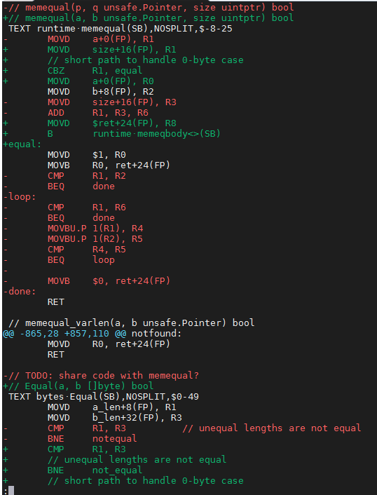
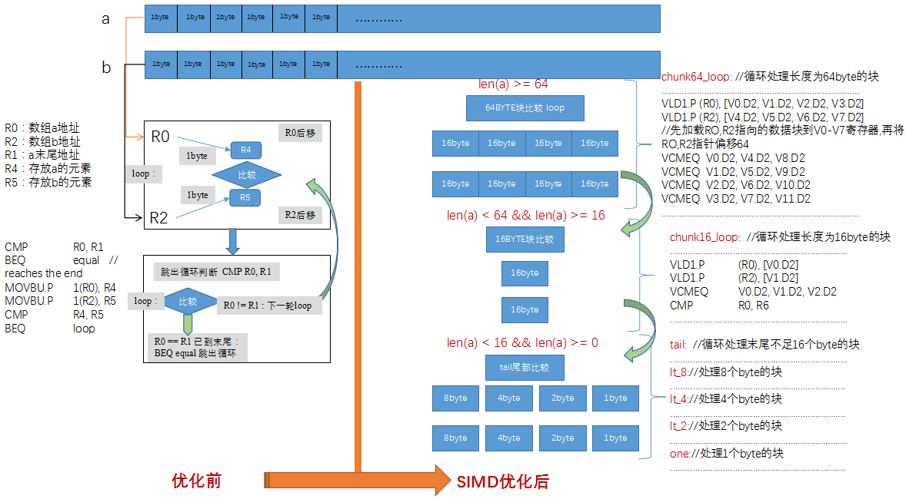

# 基于并行化技术优化通用字符串比较性能
[SIMD即单指令多数据流(Single Instruction Multiple Data)](https://en.wikipedia.org/wiki/SIMD)，通过一条指令同时对多个数据进行运算，能够有效提高CPU的运算速度，主要适用于计算密集型、数据相关性小的多媒体、数学计算、人工智能等领域。  
[Go](https://golang.org/doc/)是一种快速、静态类型的开源语言，可以用来轻松构建简单、可靠、高效的软件。包含垃圾回收的便利性和运行时反射的功能。他的并发机制使go程序可以在多核和联网机器中获得最大收益。目前已经包括丰富的基础库如数学库、加解密库、图像库、编解码等等。对于性能要求较高且编译器目前还不能优化的场景，Go语言通过在底层使用汇编技术进行了优化，其中最重要的就是SIMD技术。  
本文通过Go语言开源社区在ARM硬件平台的优化案例，介绍应用ARM SIMD技术的方法。
### 1. 环境准备
- 硬件配置：鲲鹏(ARM64)云Linux服务器-[通用计算增强型KC1 kc1.2xlarge.2(8核|16GB)](https://www.huaweicloud.com/product/ecs.html)
- [Golang发行版 >= 1.12.1](https://golang.org/dl/)，此处开发环境准备请参考文章：[Golang 在ARM64开发环境配置](https://github.com/OptimizeLab/docs/blob/master/tutorial/environment/go_dev_env/go_dev_env.md)
- [Golang github源码仓库](https://github.com/golang/go)下载，此处通过[Git安装和使用](https://git-scm.com/book/zh/v2)进行版本控制
- 通过在bash命令行执行如下指令，拉取github代码托管平台上golang的代码仓：
```bash
$ git clone https://github.com/golang/go
```
### 2. 社区的ARM SIMD优化方案
那么如何获取Go语言的SIMD指令优化方案呢？包含两种查看优化记录的方法：  
1、在网页查看优化提交记录[ChangeList](http://svnbook.red-bean.com/en/1.8/svn.advanced.changelists.html)：
  
2、在本地源码仓查看和比较性能，进入刚下载的go源码目录下，此时处于master分支上，展示的是最新的代码，本文已经找到了优化前后的两个提交记录，并通过这两个记录创建分支，再通过分支切换，展示优化前后的代码：
```bash
# 根据优化前的一个提交记录0c68b79创建一个新的分支before-simd，这个分支包含优化前的版本
git checkout -b before-simd 0c68b79
# 切换到分支before-simd，此时目录下的代码文件已经变成了优化前的版本
git checkout before-simd
# 根据优化后提交记录78ddf27创建一个新的分支after-simd，这个分支包含优化后的版本
git checkout -b after-simd 78ddf27
# 切换到分支after-simd，此时目录下的代码文件已经变成了优化后的版本
git checkout after-simd
# 根据commitid查看变更
git show 78ddf27
```
代码变更如图所示：

为便于理解，下图展示了优化前的汇编函数EqualBytes与编写go代码的对应关系，此处对于一行go代码a[i]!=b[i]，需要四条汇编指令：1. 两条取数指令，分别将切片数组a和b中的byte值取到寄存器中；2. 通过比较指令CMP对比两个寄存器中的值，根据比较结果更新[状态寄存器](https://baike.baidu.com/item/%E7%8A%B6%E6%80%81%E5%AF%84%E5%AD%98%E5%99%A8/2477799?fr=aladdin); 3. 跳转指令BEQ根据状态寄存器值进行跳转，此处是等于则跳转到loop标签处，即如果相等则继续下一轮比较。


优化方法使用了SIMD技术，即单指令同时处理多个byte数据，大幅减少了数据加载和比较操作的指令条数，提升了性能   
下图是使用SIMD技术优化汇编代码前后的对比图，从图中可以看到优化前代码非常简单，循环取1 byte进行比较，使用SIMD指令优化后，代码被复杂化，这里可以先避免陷入细节，先理解实现原理，具体代码细节可以在章节[优化后代码详解]再进一步学习。此处代码变复杂的主要原因是进行了分情况的分块处理，首先循环处理64 bytes大小的分块，当数组末尾不足64 bytes时，再将余下的按16 bytes分块处理，直到余下长度为1时的情况，下图直观的演示了优化前后的对比关系和优化后分块处理的规则:
  
    
### 3. 优化前代码详解
优化前的代码循环从两个数组中取1 byte进行比较，每byte数据要耗费2个加载操作、1个比较操作、1个数组末尾判断操作，如下所示：
```assembly
//func Equal(a, b []byte) bool
TEXT bytes·Equal(SB),NOSPLIT,$0-49
//---------数据加载------------
    // 将栈上数据取到寄存器中
    // 对数组长度进行比较，如果不相等直接返回0
    MOVD a_len+8(FP), R1      // 取数组a的长度
    MOVD b_len+32(FP), R3     // 取数组b的长度
    CMP R1, R3                // 数组长度比较
    BNE notequal              // 数组长度不同，跳到notequal
    MOVD a+0(FP), R0          // 将数组a的地址加载到通用寄存器R0中
    MOVD b+24(FP), R2         // 将数组b的地址加载到通用寄存器R2中
    ADD R0, R1                // R1保存数组a末尾的地址
//-----------------------------
//--------数组循环比较操作------- 
loop:
    CMP R0, R1                // 判断是否到了数组a末尾
    BEQ equal                 // 如果已经到了末尾，说明之前都是相等的，跳转到标签equal
    MOVBU.P 1(R0), R4         // 从数组a中取一个byte加载到通用寄存器R4中
    MOVBU.P 1(R2), R5         // 从数组b中取一个byte加载到通用寄存器R5中
    CMP R4, R5                // 比较寄存器R4、R5中的值
    BEQ loop                  // 相等则继续下一轮循环操作
//----------------------------- 
//-------------不相等-----------
notequal:
    MOVB ZR, ret+48(FP)       // 数组不相等，返回0
    RET
//----------------------------- 
//-------------相等------------- 
equal:
    MOVD $1, R0               // 数组相等，返回1
    MOVB R0, ret+48(FP)
    RET
//----------------------------- 
```

### 4. 优化后代码详解
优化后的代码因为做了循环展开，所有看起来比较复杂，但逻辑是很清晰的，即采用分块的思路，将数组划分为64/16/8/4/2/1bytes大小的块，最大程度发挥SIMD指令的优势，使用多个向量寄存器，每次循环中尽可能处理更多的数据。汇编代码解读如下(代码中添加了关键指令注释）：
```assembly
// 函数的参数，此处是通过寄存器传递参数的
// 调用memeqbody的父函数已经将参数放入了如下寄存器中
// R0: 寄存器R0保存数组a的地址
// R1: 寄存器R1数组a的末尾地址
// R2: 寄存器R2保存数组b的地址
// R8: 寄存器R8存放比较的结果
TEXT runtime·memeqbody<>(SB),NOSPLIT,$0
//---------------数组长度判断-----------------
// 根据数组长度判断按照何种分块开始处理
    CMP    $1, R1                        
    BEQ    one
    CMP    $16, R1                       
    BLO    tail
    BIC    $0x3f, R1, R3                 
    CBZ    R3, chunk16                   
    ADD    R3, R0, R6                    

//------------处理长度为64 bytes的块-----------
// 按64 bytes为块循环处理
chunk64_loop: 
// 加载RO,R2指向的数据块到SIMD向量寄存器中，并将RO,R2指针偏移64位                          
    VLD1.P (R0), [V0.D2, V1.D2, V2.D2, V3.D2]
    VLD1.P (R2), [V4.D2, V5.D2, V6.D2, V7.D2]
// 使用SIMD比较指令，一条指令比较128位，即16个bytes，结果存入V8-v11寄存器
    VCMEQ  V0.D2, V4.D2, V8.D2           
    VCMEQ  V1.D2, V5.D2, V9.D2
    VCMEQ  V2.D2, V6.D2, V10.D2
    VCMEQ  V3.D2, V7.D2, V11.D2  
// 通过SIMD与运算指令，合并比较结果，最终保存在寄存器V8中    
    VAND   V8.B16, V9.B16, V8.B16        
    VAND   V8.B16, V10.B16, V8.B16
    VAND   V8.B16, V11.B16, V8.B16 
// 下面指令判断是否末尾还有64bytes大小的块可继续用这里循环
// 判断是否相等，不相等则直接跳到not_equal返回
    CMP    R0, R6                        // 比较指令，比较RO和R6的值，修改寄存器标志位，对应下面的BNE指令      
    VMOV   V8.D[0], R4 
    VMOV   V8.D[1], R5                   // 转移V8寄存器保存的结果数据到R4,R5寄存器
    CBZ    R4, not_equal 
    CBZ    R5, not_equal                 // 跳转指令，若R4,R5寄存器的bit位出现0，表示不相等，跳转not_equal
    BNE    chunk64_loop                  // 标志位不等于0，对应上面RO!=R6则跳转chunk64_loop
    AND    $0x3f, R1, R1                 // 仅保存R1末尾的后6位，这里保存的是末尾不足64bytes块的大小
    CBZ    R1, equal                     // R1为0,跳转equal，否则向下顺序执行

...............................................
...............................................
                  
//-----------循环处理长度为16 bytes的块------------
chunk16_loop:                            
    VLD1.P (R0), [V0.D2] 
    VLD1.P (R2), [V1.D2]
    VCMEQ    V0.D2, V1.D2, V2.D2
    CMP R0, R6
    VMOV V2.D[0], R4
    VMOV V2.D[1], R5
    CBZ R4, not_equal                  
    CBZ R5, not_equal
    BNE chunk16_loop                   
    AND $0xf, R1, R1
    CBZ R1, equal                     
//---------处理在末尾长度小于16 bytes的块---------
tail:                                  
    TBZ $3, R1, lt_8                   
    MOVD.P 8(R0), R4
    MOVD.P 8(R2), R5
    CMP R4, R5    
    BNE not_equal 

lt_8:                                  
    TBZ $2, R1, lt_4
    MOVWU.P 4(R0), R4
    MOVWU.P 4(R2), R5
    CMP R4, R5
    BNE not_equal

lt_4:                                 
    TBZ $1, R1, lt_2
    MOVHU.P 2(R0), R4
    MOVHU.P 2(R2), R5
    CMP R4, R5
    BNE not_equal

lt_2:                                 
    TBZ     $0, R1, equal

one:                                  
    MOVBU (R0), R4
    MOVBU (R2), R5
    CMP R4, R5
    BNE not_equal
//-----------------判断相等返回1----------------
equal:
    MOVD $1, R0
    MOVB R0, (R8)
    RET
//----------------判断不相等返回0----------------
not_equal:
    MOVB ZR, (R8)
    RET
```
上述优化代码中，使用VLD1(数据加载指令)一次加载64byte数据到SIMD寄存器，再使用VCMEQ指令比较SIMD寄存器保存的数据内容得到结果，相比传统用的单字节比较方式，大大提高了大于64byte数据块的比较性能。大于16byte小于64byte块数据，使用一个SIMD寄存器一次处理16byte块的数据，小于16byte数据块使用通用寄存器保存数据，一次比较8\4\2\1byte的数据块。

### 5. 优化结果
go语言可通过[Go benchmark](https://golang.org/pkg/testing/)进行单个函数的性能测试。获得结果后通过使用[benchstat工具](https://godoc.org/golang.org/x/perf/cmd/benchstat)进行优化前后的性能对比。具体使用方法请参考文章[Golang 在ARM64开发环境配置]( https://github.com/OptimizeLab/docs/blob/master/tutorial/environment/go_dev_env/go_dev_env.md)。结果如下表格： 
  
上表中可以清晰的看到使用SIMD优化后，所有的用例性能都有所提升，其中数据大小为4K时性能提升率最高，耗时减少了93.49%；每秒数据处理量提升14.29倍  
用例名/(字节数组大小-核心数)|优化前每操作耗时 time/op|优化后每操作耗时 time/op|耗时对比|优化前单位时间处理数据量|优化后单位时间处理数据量|处理数据量对比
---|---|---|---|---|---|---|
Equal/1-8   |   5.43ns ± 0%   |   5.41ns ± 0%   | -0.26%  (p=0.048 n=5+5)  | 184MB/s ± 0%  | 185MB/s ± 0%   |   ~     (p=0.056 n=5+5)
Equal/6-8   |   10.0ns ± 0%   |    6.2ns ± 0%   | -38.30%  (p=0.008 n=5+5) | 598MB/s ± 0%  | 972MB/s ± 0%   | +62.56%  (p=0.008 n=5+5)
Equal/9-8   |   12.3ns ± 0%   |    6.6ns ± 0%   | -46.67%  (p=0.029 n=4+4) | 729MB/s ± 0%  | 1373MB/s ± 0%  | +88.35%  (p=0.008 n=5+5)
Equal/15-8  |   17.0ns ± 0%   |    7.4ns ± 2%   | -56.20%  (p=0.008 n=5+5) | 881MB/s ± 0%  | 2015MB/s ± 2%  | +128.78%  (p=0.008 n=5+5)
Equal/16-8  |   17.8ns ± 0%   |    5.8ns ± 0%   | -67.36%  (p=0.008 n=5+5) | 901MB/s ± 0%  | 2755MB/s ± 0%  | +205.94%  (p=0.016 n=4+5)
Equal/20-8  |   20.9ns ± 0%   |    8.0ns ± 0%   | -61.75%  (p=0.000 n=5+4) | 956MB/s ± 0%  | 2502MB/s ± 0%  | +161.84%  (p=0.016 n=5+4)
Equal/32-8  |   30.4ns ± 0%   |    7.6ns ± 0%   | -74.85%  (p=0.008 n=5+5) | 1.05GB/s ± 0% | 4.19GB/s ± 0%  | +297.49%  (p=0.008 n=5+5)
Equal/4K-8  |   3.18µs ± 0%   |   0.21µs ± 0%   | -93.49%  (p=0.000 n=5+4) | 1.29GB/s ± 0% | 19.70GB/s ± 0% | +1428.63%  (p=0.008 n=5+5)
Equal/4M-8  |   3.69ms ± 1%   |   0.65ms ± 4%   | -82.36%  (p=0.008 n=5+5) | 1.14GB/s ± 1% | 6.45GB/s ± 4%  | +466.96%  (p=0.008 n=5+5)
Equal/64M-8 |   63.3ms ± 0%   |   17.4ms ± 5%   | -72.54%  (p=0.008 n=5+5) | 1.06GB/s ± 0% | 3.86GB/s ± 5%  | +264.45%  (p=0.008 n=5+5)
[注]：ns/op:每次函数执行耗费的纳秒时间，ms/op:每次函数执行耗费的毫秒时间，MB/s：每秒处理的兆字节数据，GB/s：每秒处理的G字节数据
