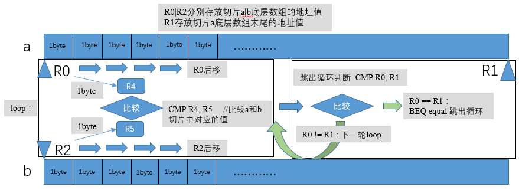
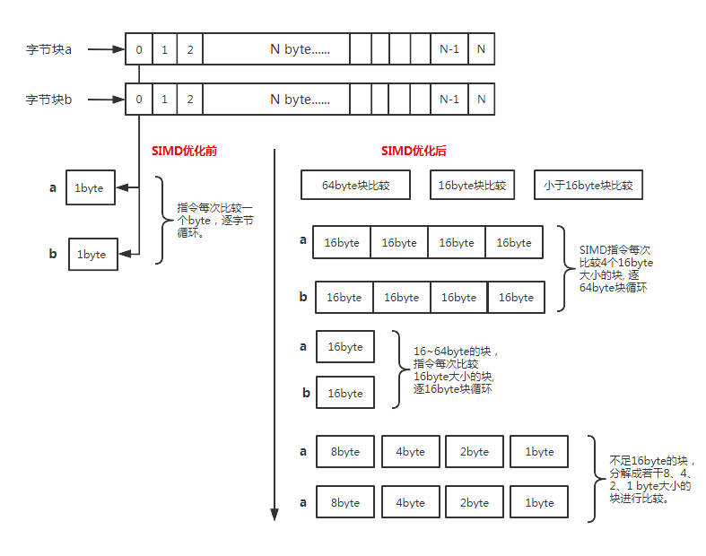
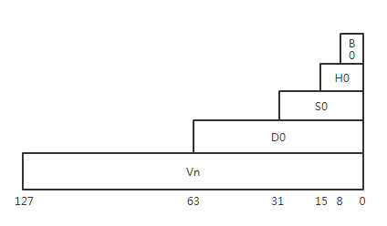

# Go-On-ARM SIMD优化入门案例
### 1. 环境配置
Go语言开发包是go语言的实现，内容包括版本的语法、编译、运行、标准库以及其他一些必要资源。

1.1 Goland语言包官网：http://goland.org/dl/。

1.2 下载打开页面之后根据自己的需求选择对应平台下载，本次安装选择的是linux平台arm架构下64位安装。如下图所示：


1.3 进入你的linux平台，进入你存放安装包的目录下，输入命令：

```linux
wget https://dl.google.com/go/go1.14.2.linux-arm64.tar.gz
```

进行下载，下载结果如图所示。


1.4 执行tar解压到/usr/loacl目录下（官方推荐），得到go文件夹。

命令：

```linux
tar -C /usr/loacl -zxvf go1.14.2.linux-arm64.tar.gz
```

得到go文件夹内容，结果如图所示：


1.5 配置环境变量，输入命令：

```linux
export GOROOT=/usr/loacl/go
export PATH=$PATH:$GOROOT/bin
```

1.6 输入以下命令就可以得到你的版本号：

```linux
go version
```

1.7 新建一个工作目录并且创建第一个工程目录：

```linux
#创建工作空间
mkdir $HOME/go
#编辑 ~/.bash_profile 文件
#将你的工作目录声明到环境变量中
export GOPATH=$HOME/go
#保存退出后source一下
source ~./bash_profile
#之后创建并进入你的第一个目录
mkdir -p $GOPATH/hello && cd $GOPATH/src/hello
```

1.8 在工作目录下创建名为hello.go 的文件，使用vim，如果没有安装可以使用上传一个hello的go文件或。内容如下：

```go
package main

import "fmt"

func main() {
	fmt.Printf("hello, world\n")
}
```

1.9 使用命令：go build hello.go，来构建然后使用命令：./hello来运行。


1.10 环境准备完成。

### 2. 什么是SIMD
SIMD技术全称Single Instruction Multiple Data，即单指令多数据流，通过单条指令并行操作一组数据替换原来的多条指令或循环操作，实现性能提升。ARM64支持的SIMD指令数约400个左右，包含数据加载和存储、数据处理、压缩、加解密等。ARM64包含32个SIMD向量寄存器用于SIMD操作，可以批量加载一组数据到向量寄存器中，使用SIMD指令对向量寄存器中的数据运算后，批量存到内存。SIMD技术常用于多媒体、数学库、加解密算法库等包含循环处理数组元素的场景，通过SIMD指令和向量寄存器的帮助减少其中数据加载和存储、数学运算、逻辑运算、移位等常用操作所需的指令条数。那什么时候可以使用SIMD进行优化呢？
### 3. 使用SIMD优化byte切片的equal操作
从SIMD的介绍可以看出，SIMD适用于大量重复、简单的运算。在这里我们选取Golang官方的一个SIMD优化案例来进行介绍，该CL地址为：
https://go-review.googlesource.com/c/go/+/71110
#### 3.1 代码获取
我们打开CL页面找到优化前后的Commit ID，如图  
  
优化前的Commit ID：0c68b79  
优化后的Commit ID：78ddf27  
```bash
$ git clone https://go.googlesource.com/go
$ cd go/src

# 根据优化前的Commit ID创建before-simd分支
$ git checkout -b before-simd 0c68b79

# 根据优化后的Commit ID创建after-simd分支
$ git checkout -b after-simd 78ddf27
```
#### 3.2 优化前的性能问题溯源
为了以后更好的发现和分析性能问题，我们在这里对优化前的代码进行一下性能问题溯源。
##### 3.2.1 编译并运行测试用例
```bash
# 切换到优化前的分支
$ git checkout before-simd

# 从源码编译 Go
$ bash make.bash 
   
# 设置临时环境变量（仅在本条命令中有效），并使用新编译的 Go 执行测试用例
$ GOROOT=`pwd`/..; $GOROOT/bin/go test bytes -v -bench ^BenchmarkEqual$ -run ^$ -cpuprofile=cpu.out
goos: linux
goarch: arm64
pkg: bytes
BenchmarkEqual/0-8              500000000               3.84 ns/op
BenchmarkEqual/1-8              300000000               5.44 ns/op       183.74 MB/s
BenchmarkEqual/6-8              100000000               10.0 ns/op       598.26 MB/s
BenchmarkEqual/9-8              100000000               12.4 ns/op       728.51 MB/s
BenchmarkEqual/15-8             100000000               17.0 ns/op       880.77 MB/s
BenchmarkEqual/16-8             100000000               17.8 ns/op       901.06 MB/s
BenchmarkEqual/20-8             100000000               20.9 ns/op       956.05 MB/s
BenchmarkEqual/32-8              50000000               30.5 ns/op      1050.11 MB/s
BenchmarkEqual/4K-8                500000               3176 ns/op      1289.51 MB/s
BenchmarkEqual/4M-8                   500            3468668 ns/op      1209.20 MB/s
BenchmarkEqual/64M-8                   20           53439570 ns/op      1255.79 MB/s
PASS
ok      bytes   18.907s
```
保存上面输出的性能测试结果，我们将在最后的结果验证中，与优化的结果进行对比。
#### 3.2.2  pprof工具进行性能分析
在上一步的 go test 命令中，我们使用了 "-cpuprofile=cpu.out" 的参数，运行期间的 cup 性能分析报告将会输出到 cpu.out 中。通过 go 提供的性能分析工具 pprof ，我们可以轻松查看并分析测试过程中对 cpu 性能消耗大的函数。
```bash
$ go tool pprof cpu.out
File: bytes.test
Type: cpu
Time: Apr 16, 2020 at 6:20pm (CST)
Duration: 19.97s, Total samples = 19.93s (99.81%)
Entering interactive mode (type "help" for commands, "o" for options)
(pprof) top 3
Showing nodes accounting for 19.75s, 99.10% of 19.93s total
Dropped 14 nodes (cum <= 0.10s)
Showing top 3 nodes out of 8
      flat  flat%   sum%        cum   cum%
    14.32s 71.85% 71.85%     14.32s 71.85%  bytes.Equal /home/chan/go/src/runtime/asm_arm64.s
     4.06s 20.37% 92.22%     17.49s 87.76%  bytes_test.bmEqual.func1 /home/chan/go/src/bytes/bytes_test.go
     1.37s  6.87% 99.10%      2.31s 11.59%  bytes_test.BenchmarkEqual.func1 /home/chan/go/src/bytes/bytes_test.go
```
此处 "top 3" 列出了 cpu 消耗前3的函数。其中各项含义如下：
- flat：当前函数占用CPU的耗时  
- flat%: 当前函数占用CPU的耗时百分比  
- sun%：函数占用CPU的耗时累计百分比  
- cum：当前函数加上调用当前函数的函数占用CPU的总耗时  
- cum%：当前函数加上调用当前函数的函数占用CPU的总耗时百分比  
- 最后一列：函数名称  

我们通过 pprof 的list命令可以查看bytes.Equal方法内部的详细耗时信息：
```bash
(pprof) list bytes.Equal
Total: 19.93s
ROUTINE ======================== bytes.Equal in /home/xxx/go/src/runtime/asm_arm64.s
    14.32s     14.32s (flat, cum) 71.85% of Total
         .          .    865:   MOVD    R0, ret+24(FP)
         .          .    866:   RET
         .          .    867:
         .          .    868:// TODO: share code with memequal?
         .          .    869:TEXT bytes·Equal(SB),NOSPLIT,$0-49
     140ms      140ms    870:   MOVD    a_len+8(FP), R1
     410ms      410ms    871:   MOVD    b_len+32(FP), R3
      70ms       70ms    872:   CMP     R1, R3          // unequal lengths are not equal
         .          .    873:   BNE     notequal
     490ms      490ms    874:   MOVD    a+0(FP), R0
     300ms      300ms    875:   MOVD    b+24(FP), R2
         .          .    876:   ADD     R0, R1          // end
         .          .    877:loop:
     2.63s      2.63s    878:   CMP     R0, R1
      10ms       10ms    879:   BEQ     equal           // reaches the end
     5.72s      5.72s    880:   MOVBU.P 1(R0), R4
        4s         4s    881:   MOVBU.P 1(R2), R5
         .          .    882:   CMP     R4, R5
      40ms       40ms    883:   BEQ     loop
         .          .    884:notequal:
         .          .    885:   MOVB    ZR, ret+48(FP)
         .          .    886:   RET
         .          .    887:equal:
     380ms      380ms    888:   MOVD    $1, R0
     130ms      130ms    889:   MOVB    R0, ret+48(FP)
         .          .    890:   RET
         .          .    891:
         .          .    892:TEXT runtime·return0(SB), NOSPLIT, $0
         .          .    893:   MOVW    $0, R0
         .          .    894:   RET
```
从上面的结果可以看到，bytes.Equal 的实际处理代码已经指向了runtime包中的汇编文件 asm_arm64.s，可以看到主要的耗时热点是CMP指令和MOVBU.P指令执行
##### 3.2.3 源码分析
优化前的代码使用Golang汇编编写，实现在src/runtime/asm_arm64.s中，如下所示：
```go
//func Equal(a, b []byte) bool
TEXT bytes·Equal(SB),NOSPLIT,$0-49
	MOVD	a_len+8(FP), R1
	MOVD	b_len+32(FP), R3
	CMP	R1, R3		// unequal lengths are not equal
	BNE	notequal
	MOVD	a+0(FP), R0
	MOVD	b+24(FP), R2
	ADD	R0, R1		// end
loop:
	CMP	R0, R1
	BEQ	equal		// reaches the end
	MOVBU.P	1(R0), R4
	MOVBU.P	1(R2), R5
	CMP	R4, R5
	BEQ	loop
notequal:
	MOVB	ZR, ret+48(FP)
	RET
equal:
	MOVD	$1, R0
	MOVB	R0, ret+48(FP)
	RET
```
该函数的定义在文件src/bytes/bytes_decl.go中，定义如下所示
```go
func Equal(a, b []byte) bool
```
参数a, b是两个切片数组，该函数按顺序挨个比较两个数组中的元素是否相等，相等返回true. 
优化前代码逻辑简析见下图：

根据上图代码解析可以看到，该函数是循环操作两个数组中的元素，当前的处理方式每次循环只能取1 byte进行比较，即每byte数据要耗费两个读取操作和两个比较操作，结合上节pprof的分析结果，如果我们能优化热点区域即取数据MOVBU.P操作和比较CMP操作，一次将多个byte读取到寄存器并进行CMP比较，将会获得明显的性能提升。

### 4. 字节块比较函数的SIMD优化

#### 4.1 SIMD优化原理图  
  
    
#### 4.2 字节块比较函数的SIMD指令优化详解
优化后的代码使用Golang汇编编写，实现在src/runtime/asm_arm64.s中。SIMD优化涉及的SIMD指令、SIMD寄存器，以及汇编代码解读如下：(代码中添加了关键指令注释）  

##### 4.2.1 SIMD寄存器
ARM64 SIMD 寄存器用Vn表示，其中n取值范围[0,31]，SIMD寄存器有128位。  
SIMD寄存器支持字节B、半字H、字S、双字D四种数据格式用于数据加载存储等处理，下图表示了Vn寄存器上D,S,H,B的所占的位关系。ARM64中SIMD寄存器的一般表示为Vn{.2D,.4S,.8H,.16B}。  
  

##### 4.2.2 SIMD指令

SIMD指令| 用法 | 含义
---|---|---
VLD1 | `VLD1 { <Vt>.<T>..<Vt4>.<T> }, [<Rn>]` |  SIMD加载指令，加载内存数据到寄存器，支持加载到1~4个SIMD寄存器
VCMEQ | `VCMEQ <Vd>.<T>, <Vn>.<T>, <Vm>.<T>` |  SIMD比较指令，比较寄存器Vd和Vn的每个bit位，并保存结果寄存器Vm，若相等保存1，否则保存0
VADD | `VADD <Vd>.<T>, <Vn>.<T>, <Vm>.<T>` | SIMD与运算指令，Vd和Vn寄存器的bit位做与运算，并保存结果到寄存器Vm
VMOV | `VMOV <Vd>.<T>, <Vn>.<T>` | SIMD转移指令，将源SIMD寄存器中的向量复制到目标SIMD寄存器中

##### 4.2.3 优化后的汇编代码详解

```go
// input:
// R0: pointer a
// R1: data len
// R2: pointer b
// R8: address to put result
TEXT runtime·memeqbody<>(SB),NOSPLIT,$0
   CMP    $1, R1
   // handle 1-byte special case for better performance
   BEQ    one
   CMP    $16, R1
   // handle specially if length < 16
   BLO    tail
   BIC    $0x3f, R1, R3  //位清除指令，清除R1的后6位存放到R3
   CBZ    R3, chunk16   //跳转指令，R3为0，跳转到chunk16
   // work with 64-byte chunks  R6为64byte块尾部指针
   ADD    R3, R0, R6 // end of chunks 
chunk64_loop: //循环处理64的byte块
   VLD1.P (R0), [V0.D2, V1.D2, V2.D2, V3.D2]
   VLD1.P (R2), [V4.D2, V5.D2, V6.D2, V7.D2]
	//先加载RO,R2指向的数据块到V0-V7寄存器,再将RO,R2指针偏移64
   VCMEQ  V0.D2, V4.D2, V8.D2
   VCMEQ  V1.D2, V5.D2, V9.D2
   VCMEQ  V2.D2, V6.D2, V10.D2
   VCMEQ  V3.D2, V7.D2, V11.D2
	//比较V0-V7SIMD寄存器中的数据，数据结果到V8-v11寄存器
   VAND   V8.B16, V9.B16, V8.B16
   VAND   V8.B16, V10.B16, V8.B16
   VAND   V8.B16, V11.B16, V8.B16  //数据比较的结果执行与操作，保存总比较结果在V8寄存器
   CMP    R0, R6  //比较指令，比较RO和R6的值，修改寄存器标志位，对应下面的BNE指令
   VMOV   V8.D[0], R4 
   VMOV   V8.D[1], R5  //转移V8寄存器保存的结果数据到R4,R5寄存器
   CBZ    R4, not_equal 
   CBZ    R5, not_equal  // 跳转指令，若R4,R5寄存器的bit位出现0，表示不相等，跳转not_equal
   BNE    chunk64_loop  //标志位不等于0，对应上面RO!=R6则跳转chunk64_loop
   AND    $0x3f, R1, R1  //仅保存R1的后6位
   CBZ    R1, equal  //R1为0,跳转equal，否则向下顺序执行
chunk16:
   // work with 16-byte chunks
   BIC    $0xf, R1, R3 //位清除指令，清除R1的后4位存到R3
   CBZ    R3, tail   //R3为0，表示R1块小于16byte，跳转到tail块
   ADD    R3, R0, R6 // end of chunks R6为16byte块尾部指针
chunk16_loop:  //循环处理16byte，处理过程类似chunk64_loop
	VLD1.P	(R0), [V0.D2] 
	VLD1.P	(R2), [V1.D2]
	VCMEQ	V0.D2, V1.D2, V2.D2
	CMP	R0, R6
	VMOV	V2.D[0], R4
	VMOV	V2.D[1], R5
	CBZ	R4, not_equal //判断是否有不等，如有0位，跳not-equal
	CBZ	R5, not_equal
	BNE	chunk16_loop //循环继续
	AND	$0xf, R1, R1
	CBZ	R1, equal //若无剩余块（小于16byte），则跳转equal，否则向下顺序执行
tail: //处理小于16byte块的尾部
	// special compare of tail with length < 16
	TBZ	$3, R1, lt_8  //跳转指令，若R1[3]==0,也就是R1小于8,跳转到lt_8
	MOVD.P	8(R0), R4
	MOVD.P	8(R2), R5
	CMP	R4, R5	
	BNE	not_equal 
lt_8://处理小于8的byte块
	TBZ	$2, R1, lt_4
	MOVWU.P	4(R0), R4
	MOVWU.P	4(R2), R5
	CMP	R4, R5
	BNE	not_equal
lt_4://处理小于4的byte块
	TBZ	$1, R1, lt_2
	MOVHU.P	2(R0), R4
	MOVHU.P	2(R2), R5
	CMP	R4, R5
	BNE	not_equal
lt_2://处理小于2的byte块
	TBZ     $0, R1, equal
one://处理一个byte的块
	MOVBU	(R0), R4
	MOVBU	(R2), R5
	CMP	R4, R5
	BNE	not_equal
equal:
	MOVD	$1, R0
	MOVB	R0, (R8)
	RET
not_equal:
	MOVB	ZR, (R8)
	RET
```
上述优化代码中，使用VLD1数据加载指令一次加载64byte数据到SIMD寄存器，再使用VCMEQ指令比较SIMD寄存器保存的数据内容得到结果，相比传统用的单字节比较方式，大大提高了大于64byte数据块的比较性能。大于16byte小于64byte块数据，使用一个SIMD寄存器一次处理16byte块的数据，小于16byte数据块使用普通寄存器保存数据，一次比较8\4\2\1byte的数据块。

### 5. 结果验证
#### 5.1 编译并执行性能测试用例
在进行了上面的汇编代码优化后，我们需要进行源码编译，使改进应用到go中。
```bash
# 切换到优化后的分支
$ git checkout after-simd

# 从源码编译 Go
$ bash make.bash 
   
# 设置临时环境变量（仅在本条命令中有效），并使用新编译的 Go 执行测试用例
$ GOROOT=`pwd`/..; $GOROOT/bin/go test bytes -v -bench ^BenchmarkEqual$ -run ^$ -cpuprofile=cpu.out 
goos: linux
goarch: arm64
pkg: bytes
BenchmarkEqual/0-8              500000000                3.63 ns/op
BenchmarkEqual/1-8              300000000                5.41 ns/op      184.67 MB/s
BenchmarkEqual/6-8              200000000                6.17 ns/op      972.19 MB/s
BenchmarkEqual/9-8              200000000                6.56 ns/op     1372.18 MB/s
BenchmarkEqual/15-8             200000000                7.39 ns/op     2029.41 MB/s
BenchmarkEqual/16-8             300000000                5.86 ns/op     2730.86 MB/s
BenchmarkEqual/20-8             200000000                7.53 ns/op     2655.50 MB/s
BenchmarkEqual/32-8             200000000                7.67 ns/op     4170.73 MB/s
BenchmarkEqual/4K-8              10000000             	  207 ns/op    19719.21 MB/s
BenchmarkEqual/4M-8                  3000              417753 ns/op    10040.15 MB/s
BenchmarkEqual/64M-8                  200             6693341 ns/op    10026.21 MB/s
PASS
ok      bytes   22.805s
```
同样，我们可以利用 pprof 工具查看优化后的cpu性能消耗，此处不做赘述
#### 5.2 对比运行结果
我们综合一下优化之前的数据，将结果统计到下表中，已便于我们查看  
  
上表中可以清晰的看到使用SIMD优化后，所有的用例都有所提升，其中处理4K的数据比较的提升率最高，耗时减少了93.48%；每秒数据处理量提升14.29倍
