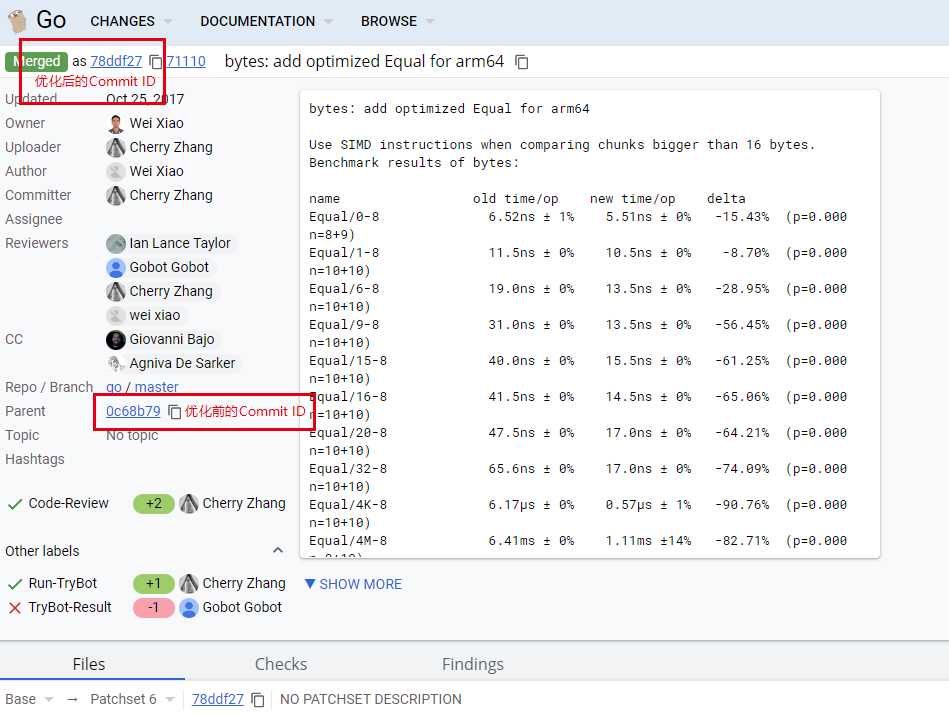

# Go-On-ARM SIMD优化入门案例
### 1. 什么是SIMD
SIMD技术全称Single Instruction Multiple Data，即单指令多数据流，通过单条指令并行操作一组数据替换原来的多条指令或循环操作，实现性能提升。ARM64支持的SIMD指令数约400个左右，包含数据加载和存储、数据处理、压缩、加解密等。ARM64包含32个SIMD向量寄存器用于SIMD操作，可以批量加载一组数据到向量寄存器中，使用SIMD指令对向量寄存器中的数据运算后，批量存到内存。SIMD技术常用于多媒体、数学库、加解密算法库等包含循环处理数组元素的场景，通过SIMD指令和向量寄存器的帮助减少其中数据加载和存储、数学运算、逻辑运算、移位等常用操作所需的指令条数。那什么时候可以使用SIMD进行优化呢？
### 2. 使用SIMD优化byte切片的equal操作
从SIMD的介绍可以看出，SIMD适用于大量重复、简单的运算。在这里我们选取Golang官方的一个SIMD优化案例来进行介绍，该CL地址为：
https://go-review.googlesource.com/c/go/+/71110
#### 2.1 代码获取
我们打开CL页面找到优化前后的Commit ID，如图  
  
优化前的Commit ID：0c68b79  
优化后的Commit ID：78ddf27  
```bash
$ git clone https://go.googlesource.com/go
$ cd go/src

# 根据优化前的Commit ID创建before-simd分支
$ git checkout -b before-simd 0c68b79

# 根据优化后的Commit ID创建after-simd分支
$ git checkout -b after-simd 78ddf27
```
#### 2.2 优化前的性能问题溯源
为了以后更好的发现和分析性能问题，我们在这里对优化前的代码进行一下性能问题溯源。
##### 2.2.1 编译并运行测试用例
```bash
# 切换到优化前的分支
$ git checkout before-simd

# 从源码编译 Go
$ bash make.bash 
   
# 设置临时环境变量（仅在本条命令中有效），并使用新编译的 Go 执行测试用例
$ GOROOT=`pwd`/..; $GOROOT/bin/go test bytes -v -bench ^BenchmarkEqual$ -run ^$ -cpuprofile=cpu.out
goos: linux
goarch: arm64
pkg: bytes
BenchmarkEqual/0-8      		500000000               3.84 ns/op
BenchmarkEqual/1-8      		300000000               5.44 ns/op       183.74 MB/s
BenchmarkEqual/6-8      		100000000               10.0 ns/op       598.26 MB/s
BenchmarkEqual/9-8      		100000000               12.4 ns/op       728.51 MB/s
BenchmarkEqual/15-8             100000000               17.0 ns/op       880.77 MB/s
BenchmarkEqual/16-8             100000000               17.8 ns/op       901.06 MB/s
BenchmarkEqual/20-8             100000000               20.9 ns/op       956.05 MB/s
BenchmarkEqual/32-8              50000000               30.5 ns/op      1050.11 MB/s
BenchmarkEqual/4K-8                500000               3176 ns/op      1289.51 MB/s
BenchmarkEqual/4M-8                   500            3468668 ns/op      1209.20 MB/s
BenchmarkEqual/64M-8                   20           53439570 ns/op      1255.79 MB/s
PASS
ok      bytes   18.907s
```

### 4. 结果验证
#### 4.1 编译并执行性能测试用例
在进行了上面的汇编代码优化后，我们需要进行源码编译，使改进应用到go中。
```bash
$ cd {你的Go源码目录}/src
# 从源码编译 Go
$ bash make.bash 
   
# 设置临时环境变量（仅在本条命令中有效），并使用新编译的 Go 执行测试用例
$ GOROOT=`pwd`/..; $GOROOT/bin/go test bytes -v -bench ^BenchmarkEqual$ -run ^$ 
goos: linux
goarch: arm64
pkg: bytes
BenchmarkEqual/0-8      		500000000                3.63 ns/op
BenchmarkEqual/1-8      		300000000                5.41 ns/op      184.67 MB/s
BenchmarkEqual/6-8      		200000000                6.17 ns/op      972.19 MB/s
BenchmarkEqual/9-8      		200000000                6.56 ns/op     1372.18 MB/s
BenchmarkEqual/15-8             200000000                7.39 ns/op     2029.41 MB/s
BenchmarkEqual/16-8             300000000                5.86 ns/op     2730.86 MB/s
BenchmarkEqual/20-8             200000000                7.53 ns/op     2655.50 MB/s
BenchmarkEqual/32-8             200000000                7.67 ns/op     4170.73 MB/s
BenchmarkEqual/4K-8              10000000             	  207 ns/op    19719.21 MB/s
BenchmarkEqual/4M-8                  3000              417753 ns/op    10040.15 MB/s
BenchmarkEqual/64M-8                  200             6693341 ns/op    10026.21 MB/s
PASS
ok      bytes   22.805s
```
#### 4.2 对比运行结果
我们综合一下优化之前的数据，将结果统计到下表中，已便于我们查看  
  
上表中可以清晰的看到使用SIMD优化后，所有的用例都有所提升，其中处理4K的数据比较的提升率最高，耗时减少了93.48%；每秒数据处理量提升14.29倍
