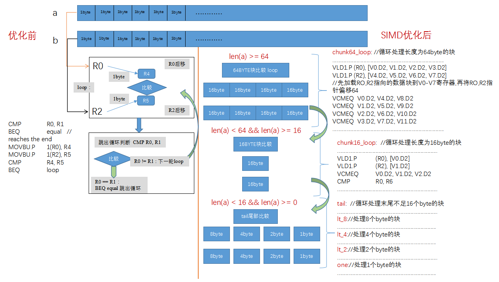

# 基于ARM SIMD技术优化Golang数组比较函数性能
###环境准备
- [Golang发行版安装 >= 1.12](https://golang.org/dl/)
- [Golang源码仓库](https://go.googlesource.com/go)下载
```bash
$ git clone https://go.googlesource.com/go
$ cd go/src
```
- 硬件配置：鲲鹏(ARM64)服务器

### 1. byte数组比较的性能问题
Golang语言支持使用表达式实现[]byte数组之间的比较，因此在以byte数组为主要存储结构，并包含比较判断的场景中，可能会存在如下的比较函数代码:
```go
func EqualByteArrAB(a, b []byte) bool {
    if len(a) != len(b) {       //长度不等则返回false
        return false
    }
    for i, _ := range a {
        if a[i] != b[i] {       //按顺序比较数组a和数组b中的每个byte
            return false
        }
    }
    return true
}
```
在实际使用中发现随着数据增长，算法的性能变得非常差，影响了正常的使用，如下benchmark结果所示：
```bash
goos: linux
goarch: arm64
pkg: test_obj/testbyteequal
BenchmarkEqual/0-8             330669548                3.64 ns/op
BenchmarkEqual/1-8             227632882                5.27 ns/op           189.74 MB/s
BenchmarkEqual/6-8             132229749                9.09 ns/op           660.35 MB/s
BenchmarkEqual/9-8             100000000                10.1 ns/op           893.80 MB/s
BenchmarkEqual/15-8             83173801                14.4 ns/op          1041.32 MB/s
BenchmarkEqual/16-8             79955283                15.0 ns/op          1069.79 MB/s
BenchmarkEqual/20-8             67353938                17.8 ns/op          1124.26 MB/s
BenchmarkEqual/32-8             45706566                26.2 ns/op          1219.49 MB/s
BenchmarkEqual/4K-8               421956                2844 ns/op          1440.18 MB/s
BenchmarkEqual/4M-8                  334             3496666 ns/op          1199.52 MB/s
BenchmarkEqual/64M-8                  18            66481026 ns/op          1009.44 MB/s
```
经过对代码的分析，性能下降是由于循环操作中执行了大量的数据加载和比较操作引起的。深入Golang官方源码分析，发现社区对EqualBytes函数做了优化，解决了本文场景下的性能问题，优化思路：利用ARM硬件架构的SIMD加速特性，该方案是用Golang汇编实现的，优化前与上述Golang语法实现的算法一致，如图：


### 2. 使用SIMD技术优化byte数组比较的性能问题
通过分析社区优化方法：[bytes: add optimized Equal for arm64](https://go-review.googlesource.com/c/go/+/71110)，发现该优化方法使用了SIMD技术，即单指令同时处理多个byte数据，大幅减少了数据加载和比较操作的指令条数，提升了性能
- [SIMD技术介绍](https://en.wikipedia.org/wiki/SIMD)
- 环境配置请参考案例[Golang在ARM64开发环境配置](../del-env-pre/del-env-pre.md)  

#### 2.1 SIMD优化前后对比  
如下是使用SIMD技术优化前后的对比图，优化前后的代码都是使用Golang汇编编写，从图中可以看到优化前代码非常简单，循环取1byte进行比较，使用SIMD指令优化后，代码变得非常复杂，这里可以先避免陷入细节，分块理解代码，变复杂的主要原因是对代码进行了分情况的分块处理，首先循环处理64byte大小的分块，当数组末尾不足64byte时，再将余下的按16byte分块处理，直到余下长度为1时的情况，详情请看下节源码和注释。
  
    
#### 2.2 优化前代码详解
优化前的代码使用Golang汇编编写，实现在src/runtime/asm_arm64.s中，该函数是循环从两个数组中取1 byte进行比较，每byte数据要耗费两个加载操作、1个byte比较操作、1个数组末尾判断操作，如下所示：
```assembly
//func Equal(a, b []byte) bool
TEXT bytes·Equal(SB),NOSPLIT,$0-49
    MOVD a_len+8(FP), R1      //取数组a的长度
    MOVD b_len+32(FP), R3     //取数组b的长度
    CMP R1, R3                //数组长度比较
    BNE notequal              //数组长度不同，跳到notequal
    MOVD a+0(FP), R0          //将数组a的地址加载到通用寄存器R0中
    MOVD b+24(FP), R2         //将数组b的地址加载到通用寄存器R2中
    ADD R0, R1                
loop:
    CMP R0, R1                //判断是否到了数组a末尾
    BEQ equal                 //调转到equal
    MOVBU.P 1(R0), R4         //从数组a中取一个byte加载到通用寄存器R4中
    MOVBU.P 1(R2), R5         //从数组b中取一个byte加载到通用寄存器R5中
    CMP R4, R5                //比较寄存器R4、R5中的值
    BEQ loop                  //相等则继续下一轮循环操作
notequal:
    MOVB ZR, ret+48(FP)       //数组不相等，返回0
    RET
equal:
    MOVD $1, R0               //数组相等，返回1
    MOVB R0, ret+48(FP)
    RET
```

#### 2.3 优化后代码详解
优化后的代码实现在src/runtime/asm_arm64.s中。SIMD优化涉及的SIMD指令、SIMD寄存器，以及汇编代码解读如下(代码中添加了关键指令注释）：
```assembly
// input:
// R0: pointer a
// R1: data len
// R2: pointer b
// R8: address to put result
TEXT runtime·memeqbody<>(SB),NOSPLIT,$0
    CMP    $1, R1
    BEQ    one
    CMP    $16, R1                       // 处理长度小于16的情况
    BLO    tail
    BIC    $0x3f, R1, R3                 //位清除指令，清除R1的后6位存放到R3
    CBZ    R3, chunk16                   //跳转指令，R3为0，跳转到chunk16
    ADD    R3, R0, R6                    //R6为64byte块尾部指针
chunk64_loop:                           //循环处理64的byte块
    VLD1.P (R0), [V0.D2, V1.D2, V2.D2, V3.D2]
    VLD1.P (R2), [V4.D2, V5.D2, V6.D2, V7.D2]
    VCMEQ  V0.D2, V4.D2, V8.D2           //先加载RO,R2指向的数据块到V0-V7寄存器,再将RO,R2指针偏移64
    VCMEQ  V1.D2, V5.D2, V9.D2
    VCMEQ  V2.D2, V6.D2, V10.D2
    VCMEQ  V3.D2, V7.D2, V11.D2          
    VAND   V8.B16, V9.B16, V8.B16        //比较V0-V7SIMD寄存器中的数据，数据结果到V8-v11寄存器
    VAND   V8.B16, V10.B16, V8.B16
    VAND   V8.B16, V11.B16, V8.B16       //数据比较的结果执行与操作，保存总比较结果在V8寄存器
    CMP    R0, R6                        //比较指令，比较RO和R6的值，修改寄存器标志位，对应下面的BNE指令
    VMOV   V8.D[0], R4 
    VMOV   V8.D[1], R5                   //转移V8寄存器保存的结果数据到R4,R5寄存器
    CBZ    R4, not_equal 
    CBZ    R5, not_equal                 // 跳转指令，若R4,R5寄存器的bit位出现0，表示不相等，跳转not_equal
    BNE    chunk64_loop                  //标志位不等于0，对应上面RO!=R6则跳转chunk64_loop
    AND    $0x3f, R1, R1                 //仅保存R1的后6位
    CBZ    R1, equal                     //R1为0,跳转equal，否则向下顺序执行
chunk16:                                //处理长度小于16的块
    BIC    $0xf, R1, R3                  //位清除指令，清除R1的后4位存到R3
    CBZ    R3, tail                      //R3为0，表示R1块小于16byte，跳转到tail块
    ADD    R3, R0, R6                    //R6为16byte块尾部指针
chunk16_loop:                           //循环处理16byte，处理过程类似chunk64_loop
    VLD1.P (R0), [V0.D2] 
    VLD1.P (R2), [V1.D2]
    VCMEQ    V0.D2, V1.D2, V2.D2
    CMP R0, R6
    VMOV V2.D[0], R4
    VMOV V2.D[1], R5
    CBZ R4, not_equal                  //判断是否有不等，如有0位，跳not-equal
    CBZ R5, not_equal
    BNE chunk16_loop                   //循环继续
    AND $0xf, R1, R1
    CBZ R1, equal                      //若无剩余块（小于16byte），则跳转equal，否则向下顺序执行
tail:                                  //处理小于16byte块的尾部
    TBZ $3, R1, lt_8                   //跳转指令，若R1[3]==0,也就是R1小于8,跳转到lt_8
    MOVD.P 8(R0), R4
    MOVD.P 8(R2), R5
    CMP R4, R5    
    BNE not_equal 
lt_8:                                  //处理小于8的byte块
    TBZ $2, R1, lt_4
    MOVWU.P 4(R0), R4
    MOVWU.P 4(R2), R5
    CMP R4, R5
    BNE not_equal
lt_4:                                  //处理小于4的byte块
    TBZ $1, R1, lt_2
    MOVHU.P 2(R0), R4
    MOVHU.P 2(R2), R5
    CMP R4, R5
    BNE not_equal
lt_2:                                  //处理小于2的byte块
    TBZ     $0, R1, equal
one:                                   //处理一个byte的块
    MOVBU (R0), R4
    MOVBU (R2), R5
    CMP R4, R5
    BNE not_equal
equal:
    MOVD $1, R0
    MOVB R0, (R8)
    RET
not_equal:
    MOVB ZR, (R8)
    RET
```
上述优化代码中，使用VLD1(数据加载指令)一次加载64byte数据到SIMD寄存器，再使用VCMEQ指令比较SIMD寄存器保存的数据内容得到结果，相比传统用的单字节比较方式，大大提高了大于64byte数据块的比较性能。大于16byte小于64byte块数据，使用一个SIMD寄存器一次处理16byte块的数据，小于16byte数据块使用通用寄存器保存数据，一次比较8\4\2\1byte的数据块。

### 3. 结果验证
使用benchstat进行性能对比，整理到表格后如下所示： 
  
上表中可以清晰的看到使用SIMD优化后，所有的用例性能都有所提升，其中数据大小为4K时性能提升率最高，耗时减少了93.48%；每秒数据处理量提升14.29倍
